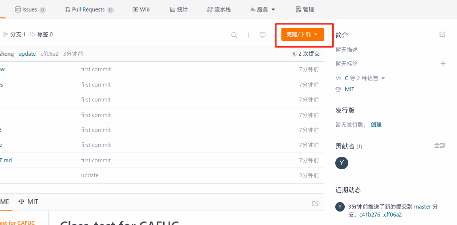
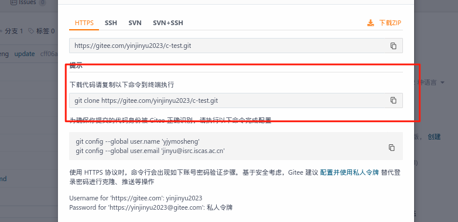

# C-program

#### 个人介绍
中飞院学生，计算机专业

熟练语言： C 、RUST

学习方向： 操作系统相关

（公益活动。这个项目纯粹面向计算机初学者,大一学生，etc）
#### 项目介绍
中飞院自己的娱乐程序分享


#### 项目逻辑
代码管理工具： git

代码托管平台： gitee（国内直连）

编程语言：C （考研专属语言、简单）

项目主要内容： xx系统（想不出来）

### 使用教程

将远程仓库 clone 到本地

```shell
git clone xxxxxxxxxxxxxxxx
```




