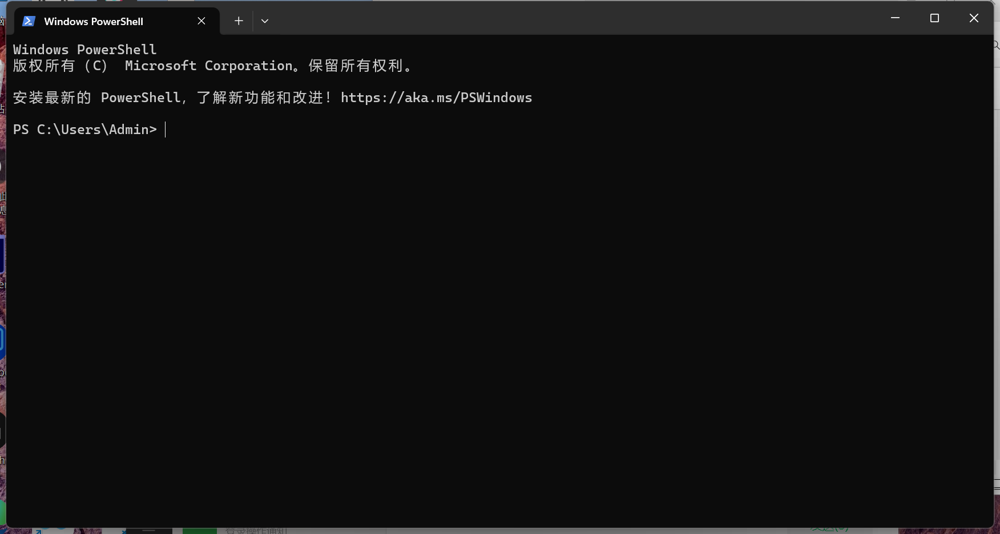
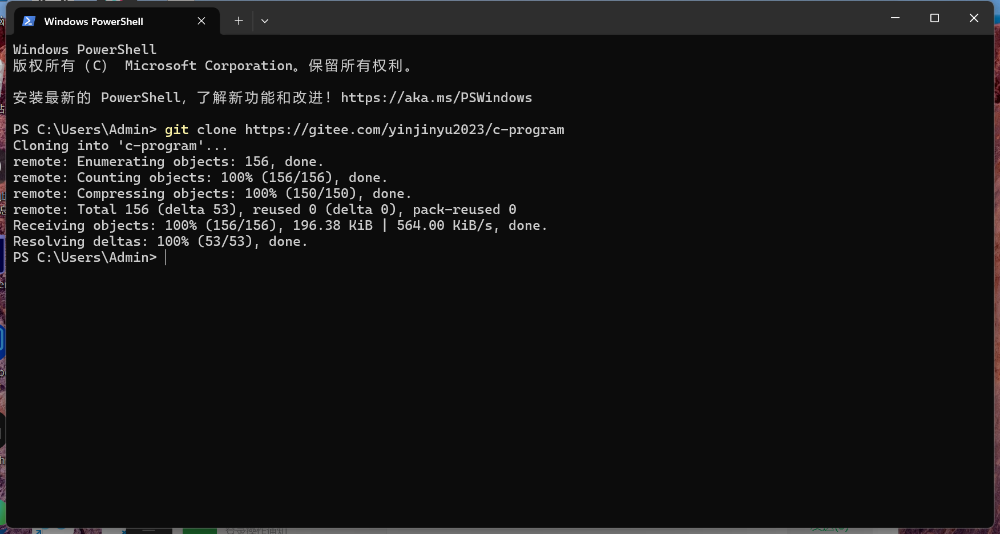

# C-ENV-guide for CAFUC

**注：本仓库仅用于学习**


# git介绍
Git 是一个开源的分布式版本控制系统，用于敏捷高效地处理任何或小或大的项目。


# git安装配置

#### Linux 平台上安装
各大 Linux 平台可以使用包管理器（apt-get、yum 等）进行安装。

（相信其他发行版的用户自己可以）

```shell
#Debian/Ubuntu系
sudo apt-get install git 

#Centos/fedora系
sudo dnf install git 
sudo yum install git

#Arch系
sudo pacman -S git
```


#### Windows 平台上安装

在 Windows 平台上安装 Git 同样轻松，有个叫做 msysGit 的项目提供了安装包，可以到 GitHub 的页面上下载 exe 安装文件并运行：
###### 安装包下载地址：https://gitforwindows.org/
直接官网下载也可以：https://git-scm.com/download/win。


下载后，双击安装包，打开界面如下所示，点击 "next" 按钮开始安装：


完成安装之后，就可以使用命令行的 git 工具（已经自带了 ssh 客户端）了，另外还有一个图形界面的 Git 项目管理工具。

在开始菜单里找到 **"Git"->"Git Bash"**，会弹出 Git 命令窗口，你可以在该窗口进行 Git 操作。


win11起还是win10，Windows内置了它们自己“包管理工具” winget

######  使用 winget 工具

如果你已经安装了 winget，可以使用以下命令来安装：

```powershell
winget install --id Git.Git -e --source winget
```

#### Mac 平台上安装  

 (笔者没用过mac电脑，写这个仅仅是自我要求，建议自行寻找，毕竟我也是网上找的)

通过 Homebrew 安装：
```shell
brew install git
```

如果您想要安装 git-gui 和 gitk（git 的提交 GUI 和交互式历史记录浏览器），您可以使用 homebrew 进行安装：
```shell
brew install git-gui
```
也可以使用图形化的 Git 安装工具，下载地址为：https://sourceforge.net/projects/git-osx-installer/

安装界面如下所示：


# git安装后的常识介绍

**注 以windows为背景介绍，Linux 没必要教，Mac我没用过、不会用**

下载安装后，回到桌面，鼠标右键，会有两栏 “git bash” "git gui"

### git bash
提供一个命令行空间，本质上和win的cmd、powershell没什么区别。

### git gui 
提供一个图形化界面，全英文，实际操作复杂、麻烦，基本也没人使用

### powershell/cmd 方案
win+r  唤出windows的启动工具，里面输入powershell 或 cmd ，会出现一个黑框框

显示PS C:\Users\<你的用户名>  这是windows终端的默认启动目录。



可以通过cd命令切换到其它目录再执行下列命令，这里直接执行（自己用文件夹找到这个目录，鼠标拖出来）



这个下载过程可能有点慢,因为我往里面塞了个50M左右的压缩包，可能以后会更改这个压缩包的存放位置


# git使用

仅介绍大学生常用指令，多余的建议自行搜索，我写不来每一种使用情况
Git 完整命令手册地址：http://git-scm.com/docs

### git配置信息

配置个人的用户名称和电子邮件地址，这是为了在每次提交代码时记录提交者的信息

```shell
git config --global user.name "xxxxx"
git config --global user.email xxxx@xxxx.com
```

### git下载仓库

仓库连接的获取方式请根据本仓库同级目录下的REAME.md文件中查看（自我提炼这个过程）

```shell
# 基本格式
# git clone 仓库连接

# 下载本仓库
git clone https://gitee.com/yinjinyu2023/c-program.git
```

### git添加文件

```shell
#添加某一具体文件，略微繁琐，但是精准
git add <file_name> 
#添加当前目录所有文件，简单直接，不过有时候不那么方便
git add . 
```

### git删除文件
```shell
#添加某一具体文件 实际的文件也会被删除
git rm <file_name> 
#添加当前目录所有文件 应该不会有人这么用吧
git add . 
```

### git提交文件到暂存区

```shell
git commit -m "xxxx"  xxxx 指代 用来批注的信息 比如 “update ” 、 “first init”
```

### git推送

```shell
#git push (远程仓库名) （远程分支名） 
git push origin master     更新origin仓库（代指，可以自己命名的一个仓库链接）的master分支（精确的分支名称）
```

### git简单总体应用
```shell
git add .
git commit -m update
git push $REPO_NAME $BRANCH_NAME
```


### git分支切换

以此仓库为例，通过git clone 下载后默认是master 分支


```shell
#切换分支
#git checkout 分支名称

#切换到ch1 代码目录
git checkout ch1
```

### git 获取内容

用来获取别人更新的内容，用来进行同步

```shell
git pull
```