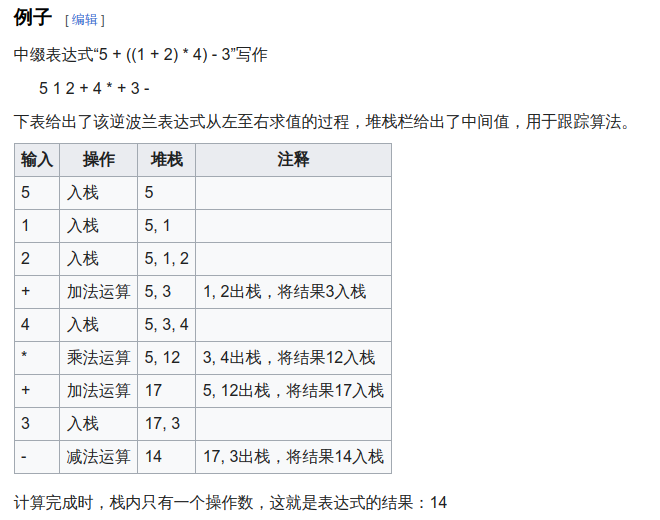

# Class-test for CAFUC

## 实验名称
简易的计算器

### 包含功能
1、逆波兰表示法计算（用来引入经典数据结构）	

#### //todo


项目结构

```shell
.
├── main.c						//运行的主体逻辑函数（程序入口）
├── console	 					//输出程序对外的内容
├── function 					//实现计算的逻辑
├── struct						//管理的数据结构
├── Makefile 					//编译、运行代码
├── program-guide.md			//讲解代码
└── README.md					//作为代码的总体理解吧
```

### 预期目的

1. 理解C语言中的多文件分层管理
2. 理解如何通过封装函数实现逻辑精简
